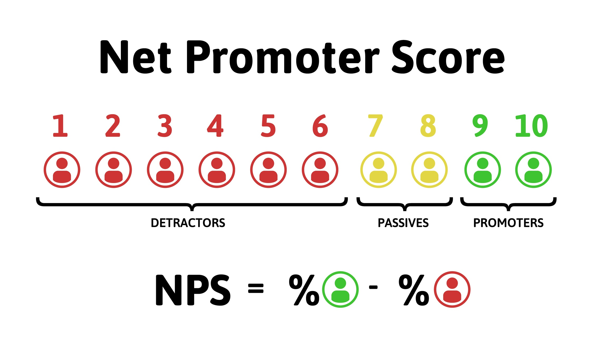

## 📋  Projeto
O projeto consiste em um API, no qual será calculado o *NPS*(Net Promoter Score). Este projeto foi desenvolvido durante a 4ª Edição da Next Level Week, promovido pela [*Rocketseat*](https://rocketseat.com.br/).

### 🤓 O que é o NPS (Net Promoter Score) ?
<!-- <div style=" height: 240px; display: flex; justify-content: center;"> -->
<div style="height: 240px;display: flex; justify-content: center;">
  
</div>

O NPS é a abreviação para Net Promoter Score, é uma metodologia de satisfação de clientes, desenvolvida para avaliar o grau de fidelidade dos clientes de qualquer perfil de empresa. [Saiba mais](https://www.netpromoter.com/know/).

### ✏   Como é cálculo o NPS?

Das respostas das notas que vão 1 à 10, podemos classifica-las em 3 categorias:
- Detratores (nota de 0-6): clientes que gostaram do produto, e que continuarão utilizando-o, além de recomendá-lo à outros.
- Passivos (nota de 7-8): clientes satisfeitos, mas pouco entusiasmados.
- Promotores (nota 9-10): clientes insatisfeitos que não gostaram do produto.

Com essas informações, usa-se a seguinte fórmula:

`(Número de Promotores - Número de Detratores) / (Número de Respostas) * 100`


### ⚙ Diagrama

<div style="height: 240px;display: flex; justify-content: center;">
  
</div>

## 🔧 Tecnologias

Este projeto foi desenvolvido em Node.js com as seguintes tecnologias:

- [Express](https://expressjs.com/);
- [NodeMailer](https://nodemailer.com/about/) e [Ethereal](https://ethereal.email/);
- [Jest](https://jestjs.io/);
- [TypeORM](https://typeorm.io/);
- [Sqlite3](https://www.npmjs.com/package/sqlite3);
- [Handlebars](https://handlebarsjs.com/);
- [Yup](https://github.com/jquense/yup);


### 🧰  Ferramentas
- [Visual Studio Code](https://code.visualstudio.com/);
- [Beekeeper](https://www.beekeeperstudio.io/);
- [Insomia](https://insomnia.rest/);

## 🚀 Como executar

Para executar o projeto realize os seguintes passos:

- Instale o Node.js.
- Instale o gerenciador de pacotes yarn.
- Execute os seguintes comandos:
```bash
git clone https://github.com/rafaelvieirab/nps-nlw4.git
cd nps-nlw4/api
yarn install
yarn typeorm migration:run
yarn dev
```

Abra o seu navegador nesse [link](http://localhost:3333/).